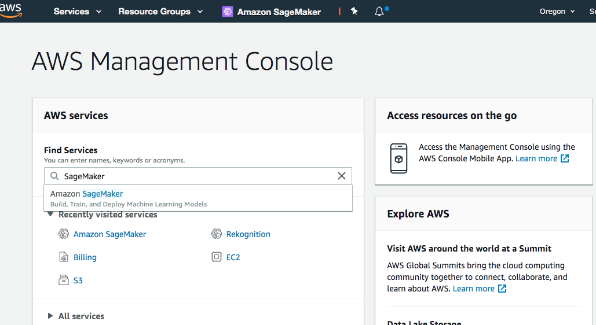
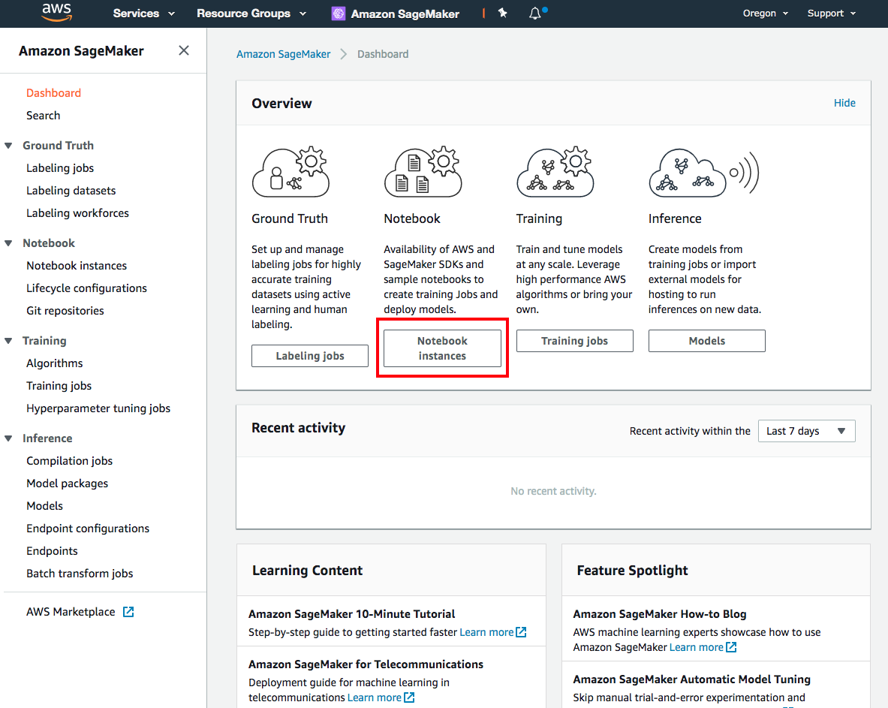
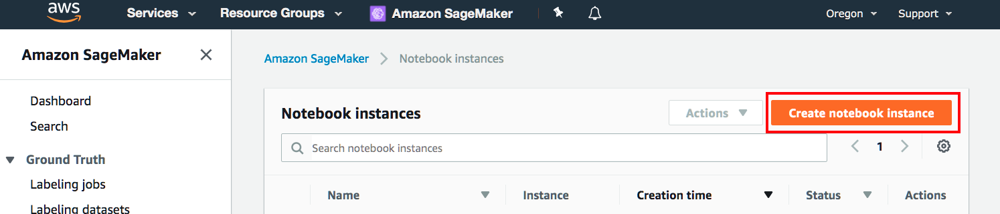
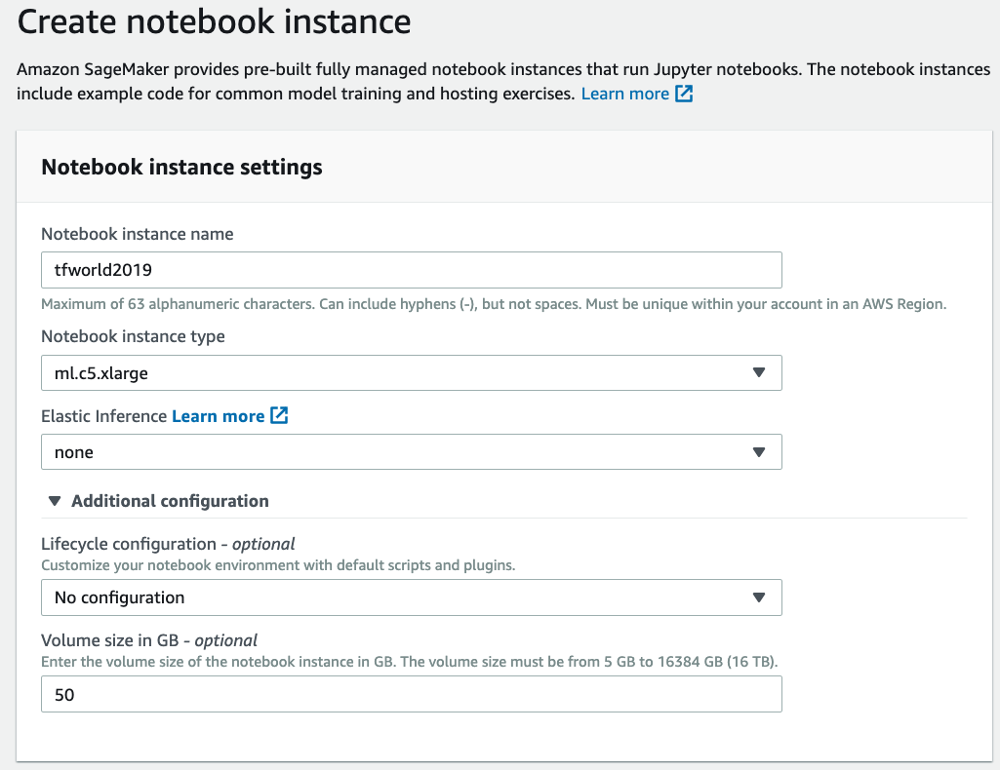
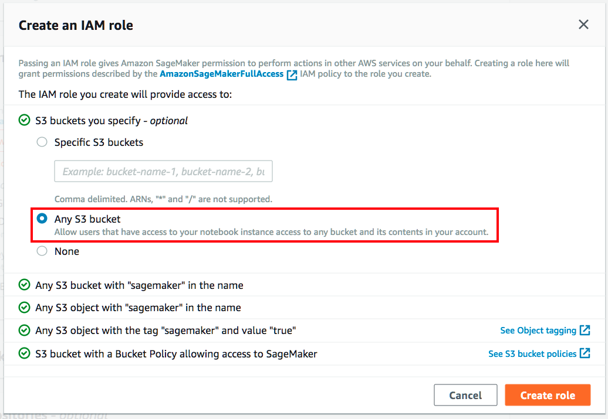
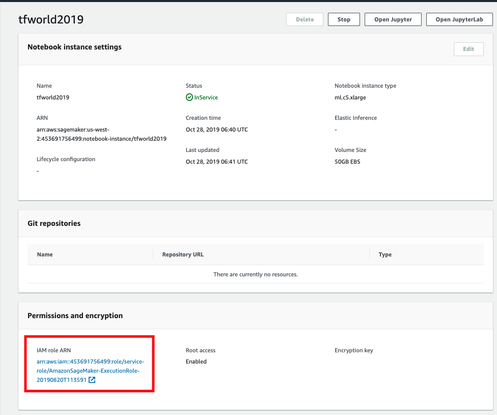
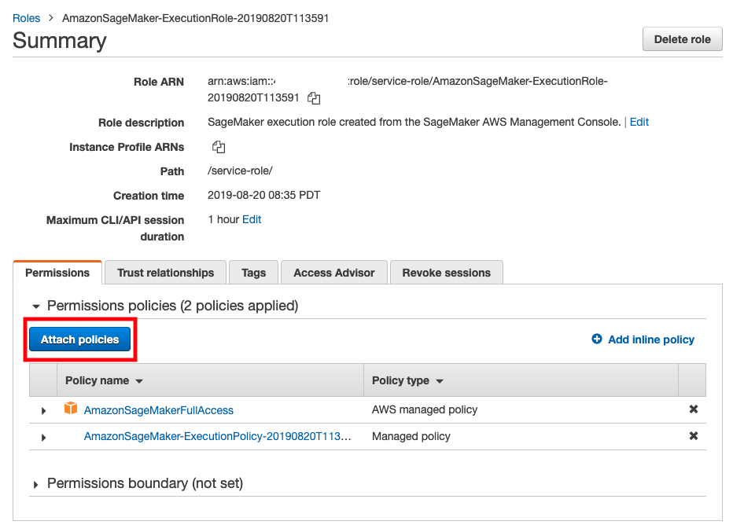

### Launch an Amazon SageMaker notebook instance

* Open the [AWS Management Console](https://console.aws.amazon.com/console/home)

* In the AWS Console search bar, type SageMaker and select Amazon SageMaker to open the service console.

* Click on Notebook Instances

* From the Amazon SageMaker > Notebook instances page, select Create notebook instance.

* In the Notebook instance name text box, enter a name for the notebook instance.
 * Choose c or m instance type. We'll only be using this instance to launch jobs. The training job themselves will run either on a SageMaker managed cluster or an Amazon EKS cluster

* To create an IAM role, from the IAM role drop-down list, select Create a new role. In the Create an IAM role dialog box, select Any S3 bucket. After that select Select **Create role**. Amazon SageMaker creates the **AmazonSageMaker-ExecutionRole-*** ** role.

* Keep the default settings for the other options and click Create notebook instance. On the **Notebook instances** section you should see the status change from *Pending -> InService*

* While the notebook instance spins up, continue to work on the next section, and we'll come back and launch the instance when it's ready.

### Give your notebook instances permissions to access ECR

* Click on the notebook name and you'll see additional details about the instance. Click on the IAM role link, this should take you to the IAM Management Console. Once there, click attach policy button.

* Select **AmazonEC2ContainerRegistryFullAccess** and click on **Attach policy**
* Close the the IAM Management Console window and head back to the SageMaker console. 
